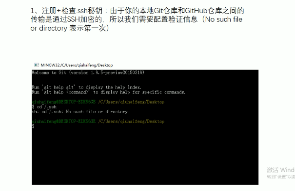
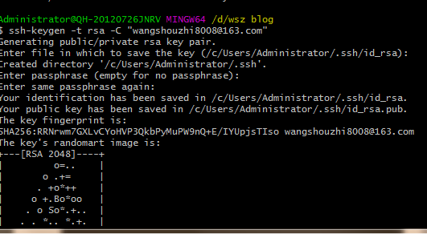
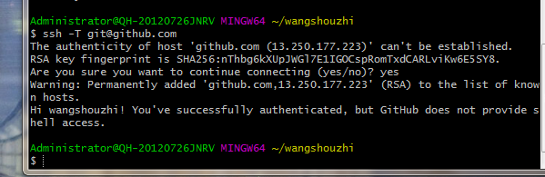
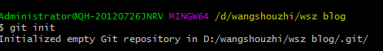
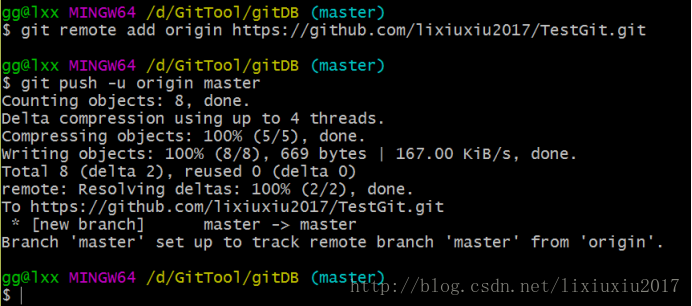

## 前言

 使用Git本地仓库存储Github个人博客项目方便更新、添加。

## Git秘钥创建

  因为本地Git仓库和远程github仓库之间的传输是通过SSH加密的，所以先要生成秘钥。
  在用户主目录C:\Users\gg下，看看有没有.ssh目录->如果有，再看看这个目录下有没有id_rsa和id_rsa.pub这两个文件->
  如果有的话，直接跳过此如下命令;如果没有的话，打开命令行，输入如下命令：ssh-keygen -t rsa -C '1434002120@qq.com'，结果如下：  
  1、秘钥存在检测 
  注意：查看指令$cd~/.ssh 如果返回为No such file or directory则表示没有为第一次

    

  2、秘钥创建
  秘钥创建命令：ssh -keygen -t rsa -C "wangshouzhi8008@163.com"   后面为个人邮箱
  创建效果如图：

    
  3、秘钥连通性
    命令ssh -T git@github.com

  

## Git与GIthub正式建立传输关系

  1、先本地新建好一个git项目，创建git仓库在要储存的盘新建文件点文件夹打开git命令窗口  使用Git init  创建仓库

  

  2、登录github,打开”settings”中的SSH Keys页面，然后点击“Add SSH Key”,填上任意title，在Key文本框里黏贴id_rsa.pub文件的内容。

  
    然后使用github正常创建项目 这个就不赘述了。  
    
  3、将本地Git仓库中的文件同步推送到GitHub中
    在本地Git仓库目录下运行如下命令：
    使用git remote add origin https://github.com/wangshouzhi/wsz-blog.git命 令关联git push -u origin master（由于新建的GitHub仓库是空的，所以第一次推送master分支时需要加-u参数，以后再推送就不用加了）

  

   推送过程中可能需要输入github的用户名和密码，推送成功后，可以立刻在github页面中看到远程库的内容已经和本地一模一样了  
  4、Git本地改动提交过程
    当本地仓库有内容改动后，  
    (1) 利用git status 查询状态  
    (2) git add . 全部添加到仓库  
    (3) git commit -m "first commit"  将项目commit到仓库 分号中的为介绍说明
