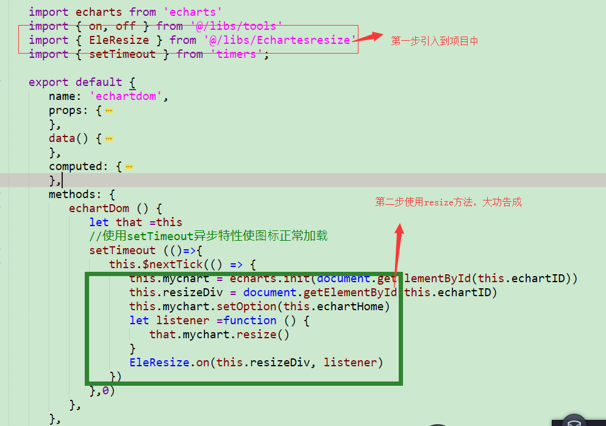

## 说明

  该解决办法主要参考 [LLDD2014425的CSDN](https://blog.csdn.net/LLDD2014425/article/details/86231174)，其中介绍了三种自适应的方法及优缺点，我在这里只简单说明下第三种没有缺点的，这里主要做个记录防止以后找不到，希望能帮到你。

### 实现在div使用onresize方法

   **实现原理：**在div上实现类似window的onresize监听，这样既能实现图表的自适应，也不会因为页面跳转之后继续执行三个页面的onresize 方法

   **实现方法：**1.引入esresize.js（文末贴上代码）
    2.在div上绑定对应onresize 方法

    .

   **优点：**
      可以根据窗口大小实现自适应
      页面跳转不会执行上次操作
      多个方法不会覆盖

   **缺点：**
       暂无发现（如有问题，欢迎各位补充）

    [文章参考：JS监听div的resize事件] (https://www.cnblogs.com/zhtui/p/7059943.html)

    2.resize代码可以直接用
     直接拿去用，挺好用的，我用Es6的方法写的根据你的需要进行改动


      (```)
      export const EleResize = {
        _handleResize: function (e) {
          var ele = e.target || e.srcElement
          var trigger = ele.__resizeTrigger__
          if (trigger) {
            var handlers = trigger.__z_resizeListeners
            if (handlers) {
              var size = handlers.length
              for (var i = 0; i < size; i++) {
                var h = handlers[i]
                var handler = h.handler
                var context = h.context
                handler.apply(context, [e])
              }
            }
          }
        },
        _removeHandler: function (ele, handler, context) {
          var handlers = ele.__z_resizeListeners
          if (handlers) {
            var size = handlers.length
            for (var i = 0; i < size; i++) {
              var h = handlers[i]
              if (h.handler === handler && h.context === context) {
                handlers.splice(i, 1)
                return
              }
            }
          }
        },
        _createResizeTrigger: function (ele) {
          var obj = document.createElement('object')
          obj.setAttribute('style',
            'display: block; position: absolute; top: 0; left: 0; height: 100%; width: 100%; overflow: hidden;opacity: 0; pointer-events: none; z-index: -1;')
          obj.onload = EleResize._handleObjectLoad
          obj.type = 'text/html'
          ele.appendChild(obj)
          obj.data = 'about:blank'
          return obj
        },
        _handleObjectLoad: function (evt) {
          this.contentDocument.defaultView.__resizeTrigger__ = this.__resizeElement__
          this.contentDocument.defaultView.addEventListener('resize', EleResize._handleResize)
        }
      }
      if (document.attachEvent) { // ie9-10
        EleResize.on = function (ele, handler, context) {
          var handlers = ele.__z_resizeListeners
          if (!handlers) {
            handlers = []
            ele.__z_resizeListeners = handlers
            ele.__resizeTrigger__ = ele
            ele.attachEvent('onresize', EleResize._handleResize)
          }
          handlers.push({
            handler: handler,
            context: context
          })
        }
        EleResize.off = function (ele, handler, context) {
          var handlers = ele.__z_resizeListeners
          if (handlers) {
            EleResize._removeHandler(ele, handler, context)
            if (handlers.length === 0) {
              ele.detachEvent('onresize', EleResize._handleResize)
              delete ele.__z_resizeListeners
            }
          }
        }
      } else {
        EleResize.on = function (ele, handler, context) {
          var handlers = ele.__z_resizeListeners
          if (!handlers) {
            handlers = []
            ele.__z_resizeListeners = handlers

            if (getComputedStyle(ele, null).position === 'static') {
              ele.style.position = 'relative'
            }
            var obj = EleResize._createResizeTrigger(ele)
            ele.__resizeTrigger__ = obj
            obj.__resizeElement__ = ele
          }
          handlers.push({
            handler: handler,
            context: context
          })
        }
        EleResize.off = function (ele, handler, context) {
          var handlers = ele.__z_resizeListeners
          if (handlers) {
            EleResize._removeHandler(ele, handler, context)
            if (handlers.length === 0) {
              var trigger = ele.__resizeTrigger__
              if (trigger) {
                trigger.contentDocument.defaultView.removeEventListener('resize', EleResize._handleResize)
                ele.removeChild(trigger)
                delete ele.__resizeTrigger__
              }
              delete ele.__z_resizeListeners
            }
          }
        }
      }
    (```)
