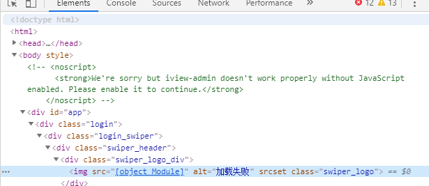
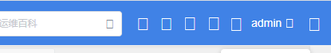

## 问题描述

  项目是基于iview搭建的管理平台项目，开发过程中项目图标不显示，使用img引入图片都不显示。  
  
  img图片显示图  

  

  项目运行效果图  
  
  

## 问题解决

网上查询一些资料，总体说是webpack打包配置问题，都尝试了，都没有解决问题。  
最后解决是解决方案是：  
npm install --save-dev file-loader@^2.0.0
即把file-loader版本换一下就可以。
## 反思

问题解决反思了一下，这个问题出现之前重新安装file-loader，当时安装命令npm install -D file-loader，然后出现的问题，当时想过是file-loader配置不对，重新配置各种配置，结果没有一个能解决问题，最后看到有个关于不同版本file-loader，尝试了一下真的可以了，好神奇，竟然是版本问题。最后总结vue脚手架搭建的项目关于webpack打包插件要注意版本。
