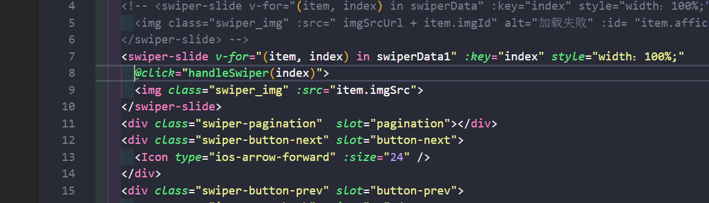

## 问题描述

  使用Swiper轮播图是设置自动轮播loop为true后，轮播图展示时会多生成一个开始和一个最后的图片，从而导致加在img标签上的是点击事件，到到最后一个是失效。  
  错误代码展示
  
  
## 思路

通过查询资料和查阅Swiper官方文档查到问题出在：
当Swiper开启轮播时轮播图会在前后多生成一个图，以便于能够循环轮播，当点击事件加载img图片上时一次轮播时正常的下一次方法就会丢失不知道点击的是哪一个，解决办法使用swiper配置的监听添加点击事件

## 具体实现

### 一、swiper数据配置

直接上代码展示方法是怎么监听加上的。

```
//滑动之后回调函数
on: {
    slideChangeTransitionEnd: function () {
    },
     // 这个是添加的点击事件
    click: function (e) {
        // 这是点击的第几个轮播
        const realIndex = e.target.id
        /**
        * e.target.className === "swiper_img" || e.target.localName === "img"
        * 这个是判断点击的是img标签或者对应的class不能随意更改
        */
        if (e.target.className === "swiper_img" || e.target.localName === "img") {
        // 这是vue中方法
        that.handleSwiper(realIndex);
        }
    }
},
  
  methods: {
    handleSwiper (index) {
      this.$emit('on-handle-swiper',index)
    }
  }
```
这里注意一点，swiper参数配置中的this不是指向vue而是swiper所以this需要提前声明，提前声明 let that = this。  
希望我的分享能够帮到你，如有问题解决如有意见欢迎提出


