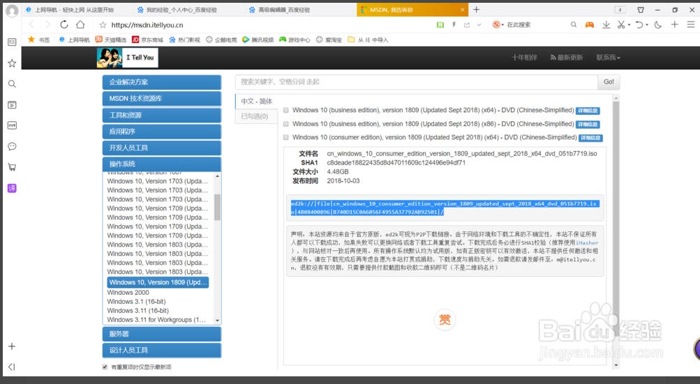
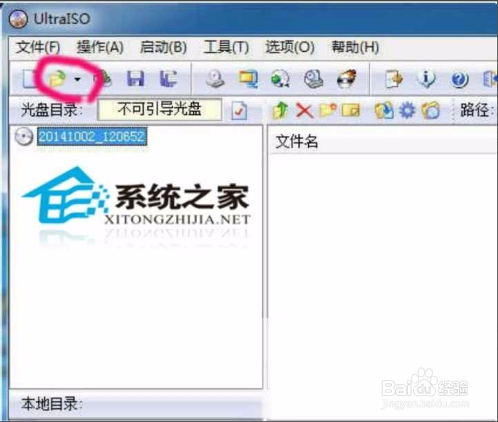
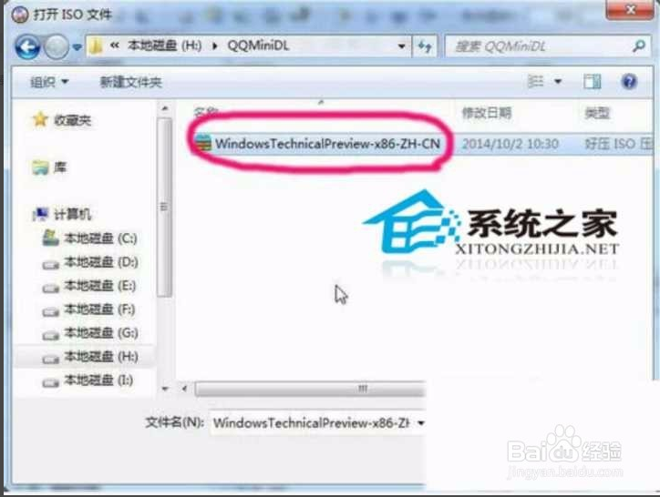
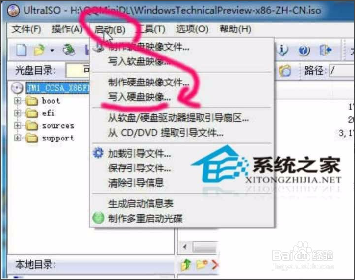
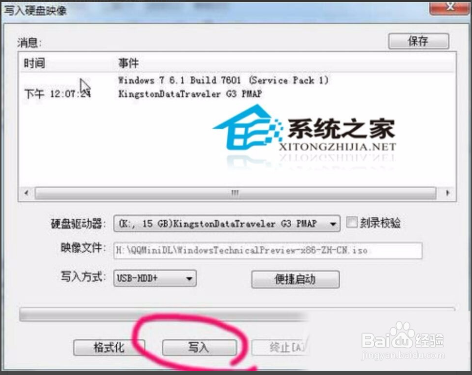
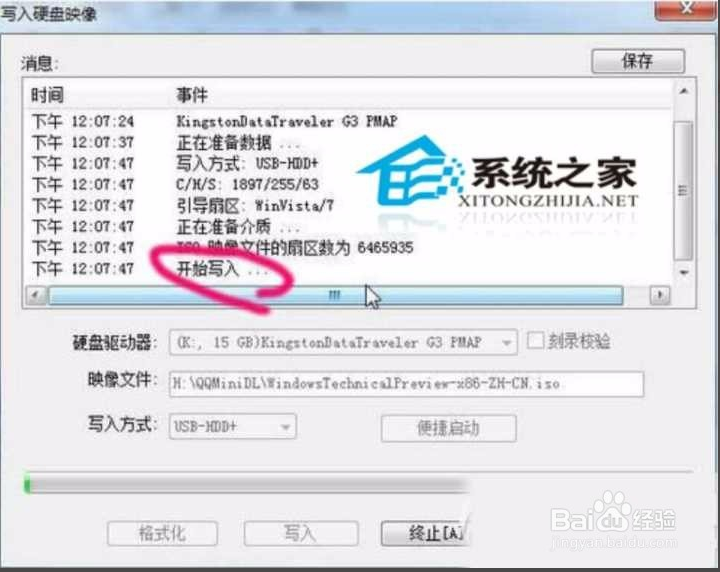
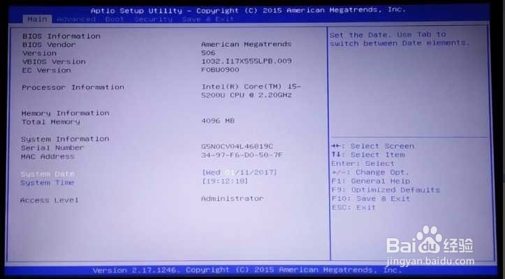
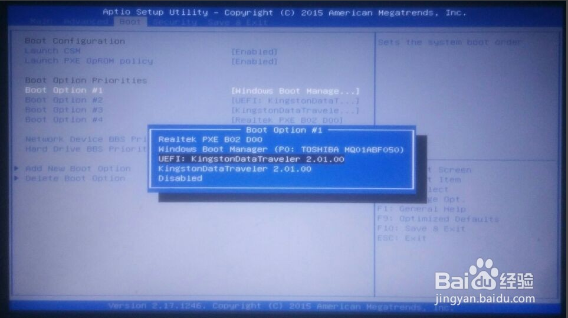
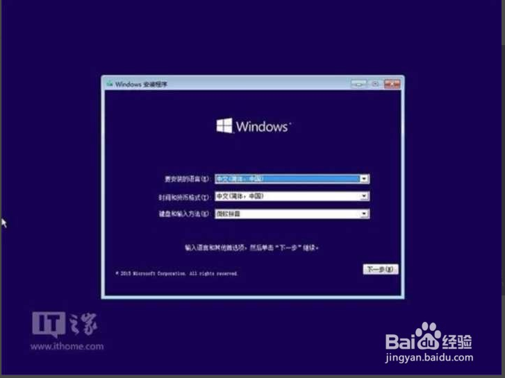

## 简介

 最近电脑系统出现问题需要重新安装系统，当需要安装时确是一脸懵不知道如何安装，之前一直认为重装系统是一个很复杂很高深，经打听其实安装系统不难，最近在网上搜索找到关于重新安装系统方法。

## 具体方法步骤

### 一、下载win10系统ISO镜像文件

下载所需要的win10系统ISO镜像文件：

1.百度搜索“msdn我告诉你”，网址为http://msdn.itellyou.cn/，进入后点击操作系统一 栏，可发现有很多操作系统供选择下载，这里我选择windows10最新版本,右边这里我选择第3个，点详细信息，复制下面的链接。（建议使用迅雷下载）

2.打开“迅雷”(电脑上没有“迅雷”的去百度下载)，复制链接，下载文件到电脑。

### 二、下载软件“UltraISO”

在电脑上下载软件“UltraISO”，插入U盘，打开“UltralSO”软件。

### 三、制作U盘映射

1.软件打开后，点击“打开”。

2.选择下载的win10系统ISO文件。

3.鼠标左键选择带光盘图样的那项，点击“启动” -》 “写入硬盘映像”。

4.弹出对话框，点击“写入”。

5.提示要格式化U盘，选择“是”。

6.开始准备数据，等待写入数据，稍等片刻，写入完毕，一个win10的U盘启动就制作完成了。

### 四、开始重装系统

1.将制作好的U盘插入要重装系统的电脑，开机画面出现电脑品牌logo时，不停地按“f2键”进入“BIOS设置”（不同电脑进入“BIOS设置”的方法可能不同，自己去百度搜到底按哪个键）。

2.通过键盘上的“右(→)方向键”选择“Boot”,然后“下(↓)方向键”选择“Boot Option #1”,然后按“enter键”，再按“上(↑)下(↓)键”选择“第三项”或“第四项”即U盘，按“enter键”，然后按“f10键”，电脑保存并重启。

3.重启后，U盘引导系统进入Win10安装程序。

## 说明

本篇文章参考所得非原创留作参考，在此有不对的地方或是不懂的地方欢迎留言讨论。
